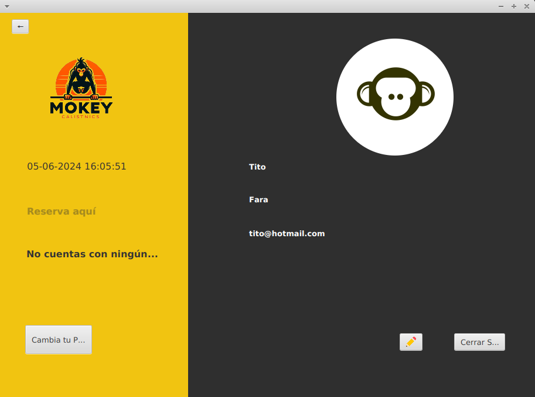

FARA SANTEYANA, María Guillermina

# Proyecto gimnasio 
Se plantea hacer un aplicación web de un gimnasio para la autogestión del cliente sobre su registro, renovación de la mensualidad, reserva de horarios en los que va a asistir para evitar la saturación del espacio. 

## Base de datos 
Necesidad de creación de una base de datos para el manejo de información. Necesitaremos de al menos, 4 tablas.
## Tabla Clientes 
**Columnas:**

**idCliente** con manejo de informacion númerica.

**Nombre:** manejo de datos alfanuméricos, no nulo, .

**Apellido:** manejo de datos alfanuméricos.

**Dni**: manejo de datos alfanuméricos.

**Teléfono**: número entero.

**Estado**: tinyint para control de informacion de estado activo e inactivo. 

## Tabla pago de cuota 
**columnas**

**Pago:** Tinyint para registrar el pago según el mes. El estado de este dato determinará el estado de la persona como cliente en el gimnasio. Es decir estará vinculada con la ``tabla cliente``. 

## Tabla Reserva de horario 
Tengo en mente realizar la reserva de horarios registrando la informacion en una base de  datos

**Dia y Hora**

**estado**

# Interfaz Gráfica 
 La web cuenta con 6 escenas con las que nos manejaremos 

**Página Principal:** 

Primera escena que se abre al ejecutar el programa con botones que darán accesos a 
Ingresar cuando ya contamos con una cuenta.
Registrate cuando aún no tenemos cuenta
Sobre nosotros: una transición que nos muestra algo de info sobre el gimnasio
Localización que no he desarrollado pero la idea era poner un mapa con la ubicación y la hora.

**Registro de Usuario:** Contendrá TextFields que reciben la información que registraremos para la creación de Clientes.

**Inicio Sessión**

**Pago de cuota:** Contendrá TextFields que reciben el pago. No lo gestionaremos desde Java al pago, solo nos sirve para tener el estado del cliente.

**Reserva de Horario:** una tabla que nos presente la semana en curso con horarios disponibles y ocupados 
los horarios disponibles podran seleccionarse, mientras que los ocupados no 
 

**La quinta depende**

# JAVA 

Trabajaremos con 5 clases para el manejo de objetos.

**Usuario:**

**Pago de cuota:**

**Reserva de Horario:**

**La quinta depende**

