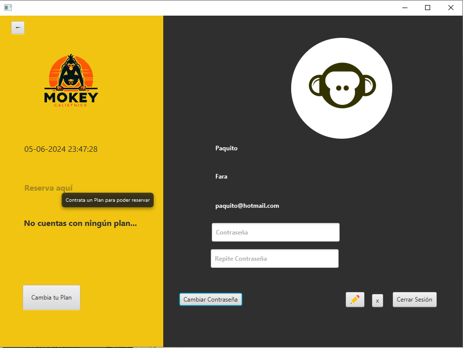

FARA SANTEYANA, María Guillermina

# Proyecto gimnasio 
Se plantea hacer un aplicación web de un gimnasio para la autogestión del cliente sobre su registro, renovación de la mensualidad, reserva de horarios en los que va a asistir. 
ACLARO:He dejado todos los comentarios de systemOutetc porque borrando comentario innecesarios me pasé y casi me cargo el código asi que hice ctrl+z y creo que quedó tal cual.

**Aclaraciones para probar la app:** 
Para el pago de la cuota necesitamos 16 digitos para el numero de la tarjeta, 3 para el cvv y 7 para el vencimiento.
Creación de los horarios para posterior reserva de turnos. Tener en cuenta que al seleccionar el dia y la hora y presionar el botón de reservar turno, el programa genera automáticamente el id de los horarios necesarios para la reserva.

## Base de datos 
Necesidad de creación de una base de datos para el manejo de información. Necesitaremos 5 tablas.

### Tabla Cliente
 cliente, que maneja la información del cliente como nif, mail, contraseña estado, idCliente(clave primaria), nombre y apellido. 

### Tabla Plan 
Muestra los planes disponibles, su id clave primaria, el importe y el detalle del plan a contratar, también un estado en caso de querer bajarlo.

### Tabla de Unión cuota
Toma datos de las tablas cliente y plan para la creación de la cuota que genera el cliente. Tanto idCliente como idPlan son claves foráneas. Tiene las fechas de inicio y de vencimiento así como un estado para que al vencer se desactive.

### Tabla Horario
Cuenta con un id, estado y fecha y hora. Tiene un estado que la idea era cancelar el horario en caso de que supere cierto número, no continué con tal idea.

### Tabla de Unión reserva
Contiene información del cliente y del horario seleccionado, es decir sus id como claves foráneas y un estado ya que pasada la fecha el horario se inactivará. 

# Interfaz Gráfica 
 La web cuenta con 6 escenas con las que nos manejaremos 

### Página Principal: 

Primera escena que se abre al ejecutar el programa con botones que darán accesos a 
**Ingresa**: cuando ya contamos con una cuenta.
**Registrate:** cuando aún no tenemos cuenta
**Sobre nosotros:** una transición que nos muestra algo de info sobre el gimnasio

**Localización:** que no he desarrollado pero la idea era poner un mapa con la ubicación y la hora.
Se despliega una imagen con la descripción y filosofía del gym. (Aclaración no solucioné el bug de la transición aunque es un boolean demasiado obvio y sencillo)

### Registrate
**Registro de Usuario:** Contendrá TextFields que reciben la información que registraremos para la creación de Clientes. No admite cadenas vacías y es necesario que la contraseña coincida.

 

### Inicio Sessión
Escena que recibe los datos del usuario, en caso de que los datos ingresados no coincidan con nuestra base de datos lo anunciará, si no coincide la contraseña arroja error de contraseña incorrecta; si no coincide el mail también lo anunciará.

### Cliente
En esta escena se muestra los datos del usuario como los planes que tiene, datos personales modificables (mail no modificable).

En caso de que el user no cuente con un plan activo y se muestra en el lateral que no cuenta con ningún plan, restringiendo también el acceso a las reservas de turno. También muestra el botón de Cambia tu Plan donde podremos contratar un paquete.
 

### Contratacion de Plan 
En el caso de que el cliente no cuente con un plan o el que tiene aún está vigente pero pronto a vencer se le da la posibilidad de hacer la contratación de un plan. 

Una vez seleccionado el plan se nos mostrará la info en el pie de la página y un Dialog para ingresar los datos 

### Reserva de turnos
Escena para reservar turnos, el cliente debe seleccionar un día en el DatePicker y entonces se activaran los botones con los horarios disponibles. Solo se verán las horas disponibles, las vencidas, fines de semana o fechas muy futuras estarán disponibles. En caso de tener una reserva activa, se mostrará el horario reservado y deberemos primero cancelarla si queremos reservar en el mismo día. Una vez seleccionado dia y hora se podrá reservar el turno quedando resgistrado en nuestra base de datos . 

Para ver todas las reservas del cliente presionaremos en Mis reservas y nos mostrará las reservas activas, su seleccionamos el checkBox nos mostrará las reservas inactivas. Sea por cancelación del turno como aquellas que vencieron por ser anteriores al día y hora en que se consulta.

Una 
# JAVA 

Trabajaremos con 5 clases para el manejo de objetos.

**Cliente:** información del cliente. getters setters, constructor y toString

**Cuota:** informacion de la cuota contratada getters setters, constructor y toString
**Horario** información de los horarios disponibles. getters setters, constructor y toString.
**HorarioReserva:** información  de las reservas que el cliente realiza. getters setters, constructor y toString
**Planes:**información de los planes para contratar o sea mensualidades o promociones. getters setters, constructor y toString

